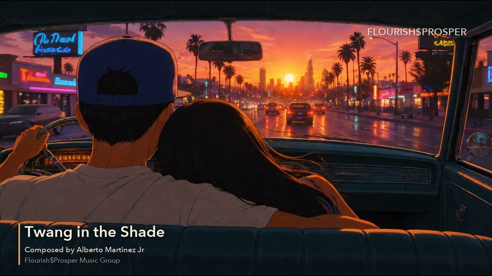
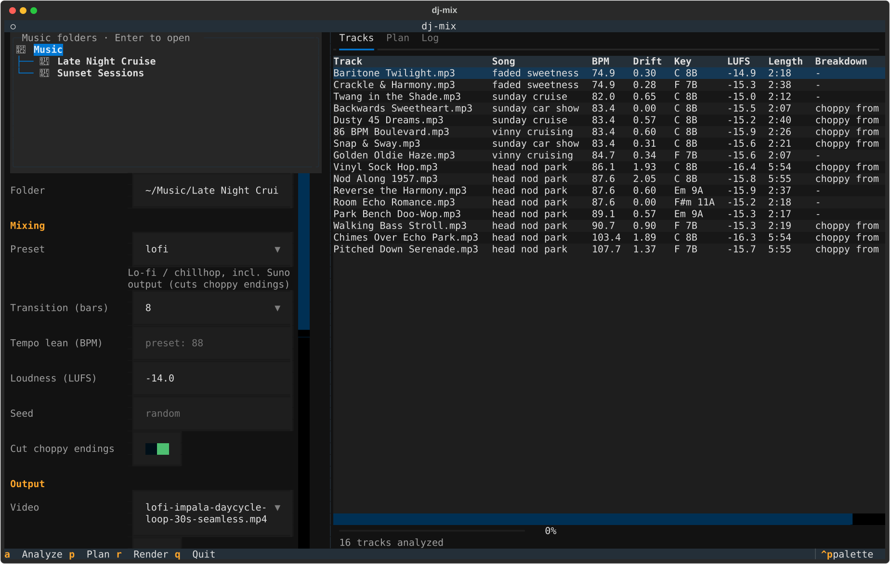
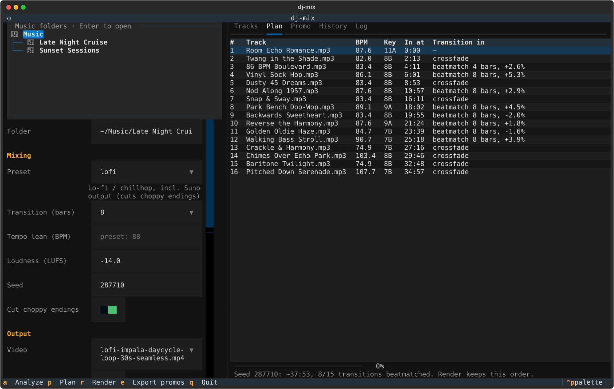
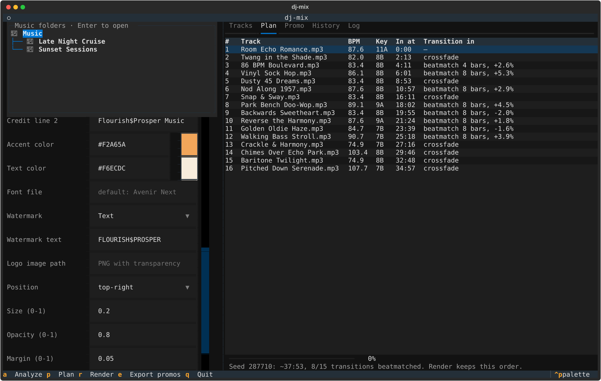
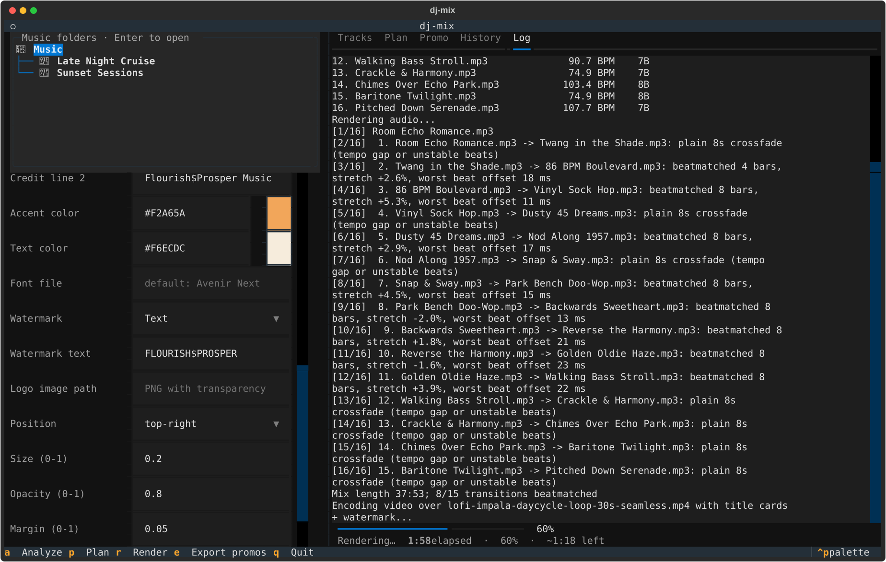
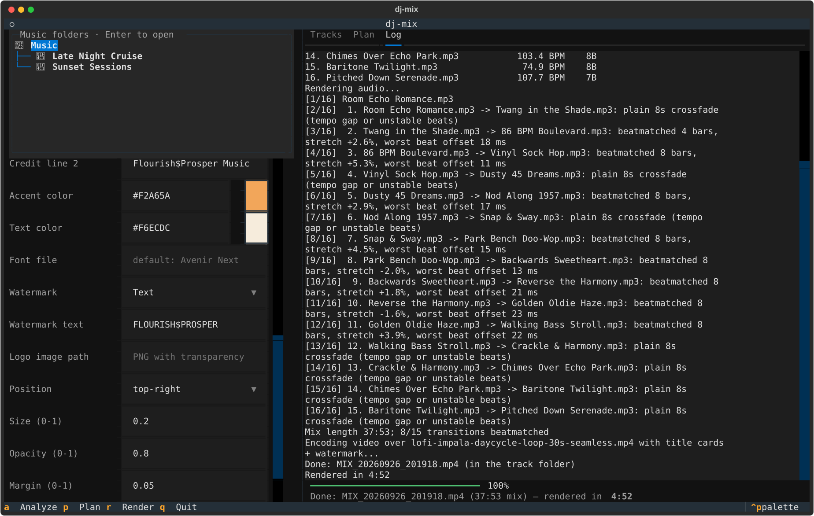
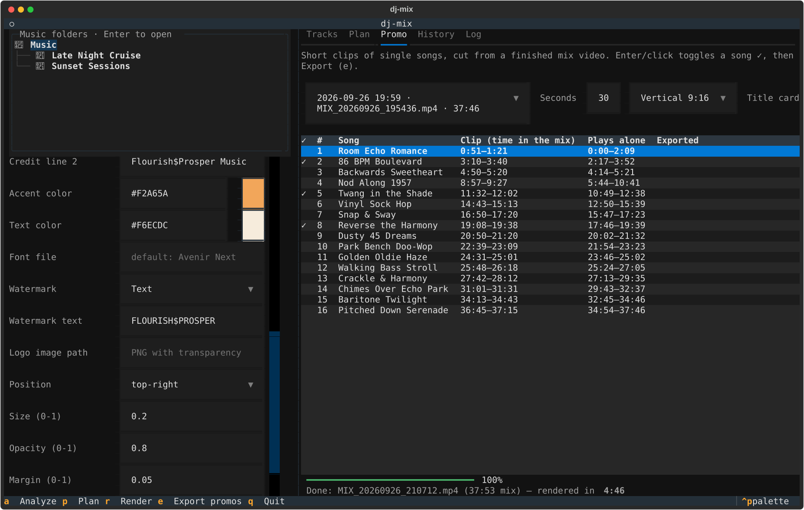
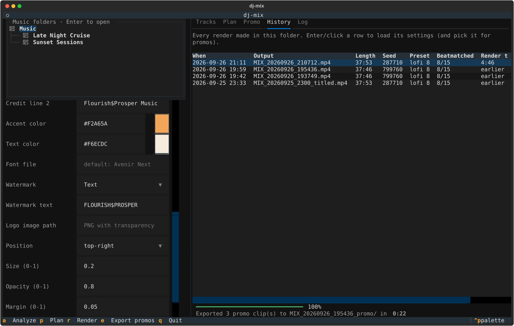
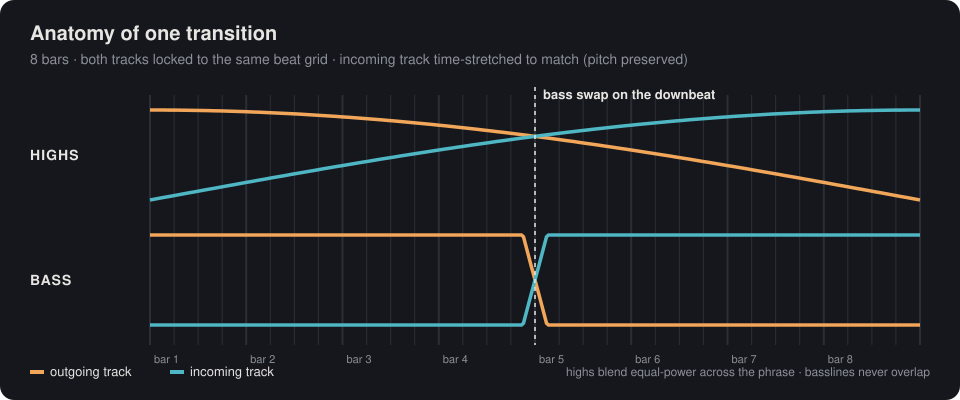

<div align="center">

# 🎚️ dj-mix

### Drop a folder of tracks in. Get a beat-matched DJ set — and a YouTube-ready video — out.

**No DAW. No DJ controller. No timeline dragging.**<br>
dj-mix listens to every track, finds the beat, plans the set, and mixes it the way a real DJ would:<br>
tempo-locked, downbeat-aligned, bass-swapped transitions — then renders the video with title cards and your brand on it.

<br>



<sub>A frame from a real dj-mix render: a looping clip, the current song's title card, and a watermark — all automatic.</sub>

<br><br>


[Install](#-install) · [Your first mix](#-your-first-mix-step-by-step) · [Features](#-feature-tour) · [CLI](#-command-line) · [How it works](#-how-it-works) · [FAQ](#-troubleshooting)

</div>

---

## Why this exists

Lo-fi channels, study-music streams, workout sets, podcast beds, AI-music catalogs — they all need the same
thing: **an hour of music that flows**, not a playlist with gaps and clashing drums between songs.

Doing that by hand means beat-gridding every track in a DAW, nudging tempos, drawing EQ automation, and
exporting a video. For a 40-minute set that's an evening of work. **dj-mix does it in about five minutes,**
and it does the fiddly parts better than a quick crossfade ever could:

| | A playlist / simple crossfade | **dj-mix** |
|---|---|---|
| Tempo | two beats fighting each other | incoming track **time-stretched to lock tempo** (pitch preserved) |
| Timing | cuts wherever the song ends | transitions start **on a downbeat, on a phrase boundary** |
| Low end | two basslines = mud | highs blend while the **bass swaps on the downbeat** |
| Loudness | jumps between songs | every track matched to **-14 LUFS** (YouTube's target) |
| Order | random | **harmonic** (Camelot wheel), tempo-aware, never two takes of the same song back to back |
| Bad endings | plays the glitchy tail | detects **choppy AI-generated breakdowns** and mixes out before them |
| Video | separate job | looped visual, **title card per song**, **watermark**, YouTube **chapter list** |
| Promotion | re-edit every song by hand | **30 s vertical/square clips per song**, cut from the finished mix |

And it's honest about its limits: when two tracks can't be matched cleanly, it tells you and falls back to a
smooth crossfade instead of a trainwreck.

---

## ✨ Highlights

- 🥁 **Real beatmatching** — its own beat tracker follows tempo drift, so even AI-generated tracks that don't hold a perfect tempo lock together.
- 🎛️ **DJ-style EQ transitions** — equal-power highs, one-beat bass swap on the middle downbeat.
- 🧠 **Set planning** — orders tracks by key compatibility and tempo, keeps alternate takes of a song apart (it reads the embedded title tag, so renaming files doesn't fool it).
- ✂️ **Breakdown detection** — spots where a track degrades into flickering "packets" of sound and cuts it.
- 🎬 **Video in the same pass** — loops your clip for the length of the mix, adds a "now playing" card for every song, your watermark or logo, and writes a tracklist you can paste straight into YouTube as chapters.
- 📱 **Promo clips in one click** — cut 30-second vertical, square or widescreen clips of any songs straight from the finished mix, each from where that song plays alone, starting on a downbeat.
- 🗂️ **Every folder remembers** — reopen a folder and you're back where you left off: last settings, last plan, every past render, and every promo you've cut.
- 🖥️ **A proper interface** — pick a folder, tweak options, *preview the whole set* before rendering, watch a live progress clock.
- 🎧 **Built-in mini player** — double-click any song, finished mix or promo clip to hear it without leaving the terminal.
- 🎚️ **Genre presets** — `lofi`, `hiphop`, `house`, `techno`, `dnb`, `pop`, `auto`.
- 🔁 **Reproducible** — every mix has a seed; the same seed renders the identical set.

---

## 📦 Install

dj-mix runs on **macOS** (tested on Apple Silicon). It should also work on Linux — see [Linux](#linux) — but that isn't tested yet.

You need three things: **Homebrew** (the macOS package manager), **ffmpeg + rubberband** (audio/video tools), and **uv** (installs dj-mix and its Python dependencies for you — you don't need to install Python yourself).

### 1. Install Homebrew (skip if you have it)

Open **Terminal** and paste:

```sh
/bin/bash -c "$(curl -fsSL https://raw.githubusercontent.com/Homebrew/install/HEAD/install.sh)"
```

Follow the prompts. When it finishes, it prints two lines starting with `echo` — run those so `brew` is on your PATH.

### 2. Install the audio/video tools and uv

```sh
brew install ffmpeg rubberband uv
```

| Tool | What dj-mix uses it for |
|---|---|
| **ffmpeg** | decoding tracks, measuring loudness, encoding the final video |
| **rubberband** | studio-quality time-stretching (changes tempo without changing pitch) |
| **uv** | installs dj-mix in its own isolated environment, including Python 3.13 if you don't have it |

Check they work:

```sh
ffmpeg -version | head -1
rubberband --version
```

### 3. Install dj-mix

```sh
uv tool install --python 3.13 git+https://github.com/flourishprosper/dj-mix
```

That's it — `dj-mix` is now a command. Python packages (librosa, numpy, scipy, soundfile, Pillow, Textual)
and sounddevice (for the mini player) are installed automatically into dj-mix's own environment and won't
touch anything else on your system.

> **Want to hack on it?** Clone instead and install in editable mode, so your code changes apply immediately:
> ```sh
> git clone https://github.com/flourishprosper/dj-mix && cd dj-mix
> uv tool install --python 3.13 -e .
> ```

To update later: `uv tool upgrade dj-mix` (or `git pull` for an editable install).

---

## 🚀 Your first mix, step by step

### Step 1 — Make a folder

Put the tracks you want in the set into one folder, plus **one looping video clip** for the visuals:

```
~/Music/Late Night Cruise/
├── Room Echo Romance.mp3
├── Twang in the Shade.mp3
├── 86 BPM Boulevard.mp3
├── …                              ← as many tracks as you like (mp3, wav, flac, aiff)
└── impala-loop-30s.mp4           ← any seamless loop (mp4 or mov); it repeats for the whole mix
```

No video? That's fine — you can render **audio only**.

> 🎵 **Got .m4a files?** Newer Suno downloads (and other sources) come as M4A/AAC/Opus/OGG, which dj-mix
> can't analyze directly. It lists only the files it can mix and **warns you** when others are present. Press
> **`c`** in the app (or run `dj-mix convert FOLDER`) to turn them into 320 kbps MP3s with their metadata
> intact. The originals are moved into `_converted-originals/`, never deleted.

> 💡 Tip: a 10–30 second clip that loops seamlessly looks best. The clip is repeated to cover the whole mix.

### Step 2 — Open dj-mix

```sh
dj-mix
```

The interface opens in your terminal. Three areas:

- **Top left — Music folders.** Browse with the arrow keys, press **Enter** on a folder to open it.
  **Right-click** a folder for *Open in Finder*, *Open in dj-mix* and *Refresh*. Added new folders, tracks or
  loop videos? Press **F5** (or the ⟳ button next to the folder path) to pick them up.
- **Left — Options.** Everything you can set, grouped into *Mixing*, *Output* and *Brand*.
- **Right — Results.** Tabs for **Tracks**, **Plan** and **Log**, with a progress bar and status line underneath.

Keys: **`a`** Analyze · **`p`** Plan · **`r`** Render · **`e`** Export promos · **`F5`** Refresh · **`q`** Quit. You can also click everything.

> 🎧 **Listen as you go.** Double-click any row to hear it in the mini player at the bottom:
> a song in **Tracks** or **Plan** plays the original track, a render in **History** plays the finished mix,
> and a song in **Promo** plays exactly the clip that would be exported. **Space** play/pause ·
> **`[`** / **`]`** back/forward 10 s · **`-`** / **`=`** volume.

### Step 3 — Pick your folder → automatic analysis

Select your folder in the **Music folders** box and press **Enter**. dj-mix analyzes every track (a few seconds
per track, cached after the first time) and fills the **Tracks** tab:



| Column | What it tells you |
|---|---|
| **BPM** | detected tempo |
| **Drift** | how much the tempo wanders (under ~1 = steady, beatmatches well) |
| **Key** | musical key + [Camelot](https://mixedinkey.com/camelot-wheel/) code used for harmonic ordering |
| **LUFS** | loudness before matching (every track is brought to the same level) |
| **Breakdown** | where a track turns choppy — the mix will end that track before this point |

### Step 4 — Choose your options

The defaults are good for lo-fi/chillhop. The ones you'll most often touch:

| Option | What it does |
|---|---|
| **Preset** | genre settings — sets the tempo range, transition length and whether to cut choppy endings |
| **Transition (bars)** | how long each blend lasts (8 bars ≈ 22 s at 86 BPM). Longer = smoother, shorter = safer for vocals |
| **Tempo lean (BPM)** | leave blank. Set it only if a genre gets detected at half or double speed |
| **Loudness (LUFS)** | -14 is YouTube's target; leave it |
| **Seed** | blank = a fresh random order each time you plan |
| **Cut choppy endings** | on for AI-generated music; off for normal releases |
| **Video** | which loop clip to use — or *Audio only* |
| **Title cards** | a "now playing" card at every song |

### Step 5 — Plan (preview the whole set)

Press **`p`**. dj-mix orders the tracks and plans every transition *without rendering anything*:



- **In at** — where each song lands in the final mix (these become your YouTube chapters).
- **Transition in** — `beatmatch 8 bars, +2.9%` means the incoming track is sped up 2.9% and locked to the beat for 8 bars; `crossfade` means the two tracks were too far apart in tempo, or too loose, to lock — it will blend them smoothly instead.

Don't like the order? Press **`p`** again for a new one. The status line shows the estimated length and how
many transitions are beatmatched. **The seed is filled in automatically**, so Render produces exactly the plan you're looking at.

### Step 6 — Brand it (optional)

Scroll the options to **Brand**:



- **Credit lines** appear under every song title on the title cards (e.g. *Composed by …* / *Your Label*).
- **Accent / Text color** — hex (`#F2A65A`) or names (`royalblue`). The swatch beside each field previews the color live; an invalid color shows a red **?**.
- **Watermark** — *Text* or *Logo image* (a PNG with transparency works best), with position, size, opacity and margin.

These settings are remembered for next time (stored in `~/.config/dj-mix/config.json`).

### Step 7 — Render

Press **`r`**. The **Log** tab shows each transition as it's mixed, and the status line runs a live clock with
percent done and time remaining:



A 40-minute mix with video takes about **5 minutes** on an Apple Silicon Mac. When it's done:



### Step 8 — Upload

Your folder now contains:

| File | |
|---|---|
| `MIX_<date>.mp4` | the finished video: same resolution as your clip, H.264 + AAC 320k, peaks limited to -1 dB |
| `MIX_<date>_tracklist.txt` | timestamps for every song, plus the seed and how long the render took |

Paste the tracklist into your YouTube description and YouTube turns it into **chapters** automatically:

```
0:00 Room Echo Romance
2:13 Twang in the Shade
4:11 86 BPM Boulevard
6:01 Vinyl Sock Hop
…
```

🎉 That's your first mix.

### Step 9 — Cut promo clips for social

Open the **Promo** tab (it unlocks once a mix has been rendered). Pick the render, tick the songs you want
(**Enter** or click a row, or **All**), set the length and format, and press **`e`** to export:



For each song, dj-mix cuts the clip from the **finished mix video**, not the source files, so it carries the
mix's sound, visuals and watermark. The clip comes from the part where that song **plays alone**, so no
neighbouring track bleeds in. It starts **on a downbeat**, skips the moment the mix's own title card is on
screen, and picks the **most energetic stretch**. The *Clip* column shows exactly what you'll get before you export.

| Format | Size | For |
|---|---|---|
| **Vertical 9:16** | 1080×1920 | Reels, TikTok, Shorts |
| **Square 1:1** | 1080×1080 | feed posts |
| **Original 16:9** | same as the mix | YouTube, X, anywhere |

Vertical and square clips fit the whole frame over a blurred fill (so the watermark and cards aren't cropped
off), with a big title card underneath. Every clip fades in and out. They're saved in a folder next to the
mix: `MIX_<date>_promo/02 Twang in the Shade (vertical, 30s).mp4`.

### Step 10 — Come back any time

Every folder remembers what you did there. Reopen it and dj-mix restores your last settings and seed, and
shows the plan you left off on. The **History** tab lists every render with its length, seed, settings, render
time and promo count:



Select a row to load that render's settings (to re-render it or tweak it) and pick it in the Promo tab. So you
can cut new promo clips from a mix you made weeks ago. Mixes rendered before history existed are added
automatically: their song timeline is rebuilt from the seed in their tracklist.

All of this lives in a small hidden folder inside your music folder:

```
Late Night Cruise/
└── _dj-mix/
    ├── history.json    every render and promo, and your last settings here
    ├── log.txt         a plain-text diary of everything done in this folder
    └── analysis.json   cached track analysis (instant reopen)
```

---

## 🧭 Feature tour

### Presets

| Preset | For | Tempo lean | Transition | Cut choppy endings |
|---|---|---|---|---|
| `lofi` | lo-fi, chillhop, **Suno/AI music** | 88 BPM | 8 bars | ✅ |
| `hiphop` | hip-hop, boom bap, R&B | 92 | 8 | |
| `house` | house, disco, deep house | 124 | 16 | |
| `techno` | techno, tech house | 130 | 16 | |
| `dnb` | drum & bass, jungle | 174 | 16 | |
| `pop` | vocal-heavy tracks | 110 | 4 | |
| `auto` | not sure — wide tempo search | 110 (loose) | 8 | |

"Tempo lean" is what the detector prefers when a beat could be read at half or double speed — it's why a
174 BPM drum & bass track isn't mistaken for 87.

### Same song, different takes

If your folder has several versions of a song (Suno gives you two per prompt: `Song.mp3`, `Song (1).mp3`),
dj-mix groups them by the **title stored inside the file** — so it still knows they're the same song after you
rename them — and never plays two takes back to back.

### Reproducible sets

Every plan has a seed. Re-render the exact same set any time:

```sh
dj-mix mix ~/Music/"Late Night Cruise" --seed 287710 --titles
```

### Add titles or a watermark to a mix you already rendered

```sh
dj-mix titles ~/Music/"Late Night Cruise"/MIX_20260925_2300.mp4
```

Re-renders the picture with title cards (and your saved watermark); the audio is copied untouched.

---

## ⌨️ Command line

Everything in the interface is also a command, handy for scripts and batch jobs.

```sh
dj-mix                          # open the interface
dj-mix ui FOLDER                # open the interface in a folder
dj-mix analyze FOLDER           # per-track report
dj-mix plan FOLDER              # order + every transition, no rendering
dj-mix mix FOLDER [options]     # render the mix (and video)
dj-mix promo FOLDER [options]   # cut promo clips of songs from a rendered mix
dj-mix history FOLDER           # every render and promo made in a folder
dj-mix convert FOLDER           # m4a/AAC/Opus/OGG/WMA -> 320k MP3 (originals kept in _converted-originals/)
dj-mix titles MIX.mp4           # add title cards / watermark to an existing mix video
```

**Mixing options** (`analyze`, `plan`, `mix`)

| Flag | Default | |
|---|---|---|
| `--preset NAME` | `lofi` | `lofi` `hiphop` `house` `techno` `dnb` `pop` `auto` |
| `--bars N` | preset | transition length in bars |
| `--bpm N` | preset | tempo the detector leans toward |
| `--seed N` | random | repeat a previous order |
| `--lufs N` | -14 | target loudness |
| `--keep-endings` / `--cut-endings` | preset | choppy-breakdown cut off / on |

**Output options** (`mix`)

| Flag | |
|---|---|
| `--video PATH` | loop clip (default: first video in the folder) |
| `--audio-only` | WAV only, no video |
| `--titles` | title card at each song |

**Promo options** (`promo`)

| Flag | Default | |
|---|---|---|
| `--render NAME` | newest | which mix to cut from (file name or history id) |
| `--songs 1,4,7` | all | song numbers in mix order |
| `--length N` | 30 | clip length in seconds |
| `--format` | `vertical` | `vertical` (9:16), `square` (1:1), `original` |
| `--no-card` | | clips without a title card |

```sh
dj-mix promo ~/Music/"Late Night Cruise" --songs 2,6,9 --format vertical
```

**Brand / watermark options** (`mix`, `titles`, `promo`)

| Flag | Default | |
|---|---|---|
| `--credit "LINE"` | saved | credit line under each title — repeat for more lines |
| `--no-credits` | | title cards with just the song name |
| `--accent COLOR` | `#F2A65A` | accent bar color |
| `--text-color COLOR` | `#F6ECDC` | title and watermark text color |
| `--font FILE` | Avenir Next | `.ttf`/`.otf` for titles and text watermark |
| `--watermark IMAGE` | | logo watermark (PNG with transparency) |
| `--watermark-text TEXT` | | text watermark |
| `--watermark-pos POS` | `top-right` | `top-left` `top-right` `bottom-left` `bottom-right` `center` |
| `--watermark-size F` | 0.12 | width as a fraction of the frame |
| `--watermark-opacity F` | 0.6 | 0–1 |
| `--watermark-margin F` | 0.03 | gap from the edge, fraction of frame width |
| `--no-watermark` | | skip the saved watermark this time |
| `--save-brand` | | save these brand options as your defaults |

Example — a house set with a logo, saved as your default look:

```sh
dj-mix mix ~/Music/friday-house --preset house --titles \
  --watermark ~/brand/logo.png --watermark-pos bottom-right --watermark-opacity 0.8 \
  --credit "Mixed by DJ You" --save-brand
```

---

## 🔬 How it works



1. **Analyze.** For each track: an onset envelope → a global tempo estimate (autocorrelation, weighted by the
   preset's tempo lean) → a dynamic-programming beat tracker that *follows* tempo drift → kick-drum energy on
   each beat (to find downbeats) → musical key (Krumhansl–Schmuckler) → integrated loudness (EBU R128) →
   breakdown detection (counts sound→silence flickers per 5-second window). Results are cached per folder.
2. **Plan.** A randomized search over orderings that scores key distance and tempo gaps, with a hard rule that
   takes of the same song never touch.
3. **Transition.** For each pair: pick the outgoing track's latest phrase-aligned downbeat before its music ends,
   and the incoming track's first downbeat. Fit a straight beat grid to each side over the overlap. If the
   tempo gap is within the preset's limit and both grids are tight (beats within 30 ms), stretch the incoming
   track to match and do the EQ transition; if not, try half the length; if still not, crossfade.
4. **Render.** Decode → rubberband time-stretch → loudness match → write one continuous 48 kHz float WAV.
5. **Encode.** Loop the clip, overlay the watermark and title cards (drawn with Pillow, faded by ffmpeg),
   limit peaks to -1 dB, encode H.264 + AAC, stop exactly at the end of the audio.
6. **Remember.** The render is saved to the folder's history with a timeline of where every song sits in the
   mix (fading in, playing alone, fading out, and its downbeats), which is what promo clips are cut from.

---

## 🛠️ Troubleshooting

<details>
<summary><b><code>dyld: Library not loaded: …libx265….dylib</code> when running ffmpeg</b></summary>

Homebrew updated a library ffmpeg depends on without rebuilding ffmpeg. Fix:
```sh
brew reinstall ffmpeg
```
</details>

<details>
<summary><b><code>Missing: rubberband</code> (or ffmpeg / ffprobe)</b></summary>

```sh
brew install ffmpeg rubberband
```
</details>

<details>
<summary><b>Everything is "crossfade", nothing beatmatches</b></summary>

- Check the **BPM** column in the Tracks tab. If tracks sit far apart (e.g. 75 vs 90), they can't be matched
  without audible stretching — that's intended.
- If a genre is being read at half/double speed (house showing ~62 BPM), pick the right **preset** or set
  **Tempo lean**.
- Live-played music (rock, jazz, oldies) drifts too much to lock; it gets clean crossfades instead.
</details>

<details>
<summary><b>A track's ending got cut off</b></summary>

That's the choppy-ending detector. Check the **Breakdown** column; if it's wrong for your music, turn off
**Cut choppy endings** (or `--keep-endings`).
</details>

<details>
<summary><b>Title text looks different on Linux</b></summary>

The default font is Avenir Next (built into macOS). Elsewhere, pass `--font /path/to/font.ttf` or set **Font file**.
</details>

### Linux

Untested, but should work: `sudo apt install ffmpeg rubberband-cli libportaudio2` (PortAudio is for the
mini player), install [uv](https://docs.astral.sh/uv/),
then the same `uv tool install` command. Reports welcome!

---

## 🗺️ Roadmap

- [ ] Vocal detection — keep two vocals from overlapping in a transition
- [ ] 3/4 and 6/8 time signatures
- [ ] Waveform preview of each transition in the interface
- [ ] Energy-curve ordering (build up / wind down)
- [ ] Tested Linux support + CI

Ideas and PRs welcome.

---

## 🤝 Contributing

```sh
git clone https://github.com/flourishprosper/dj-mix && cd dj-mix
uv sync
uv run pytest          # synthetic-beat tests: tempo per preset, downbeats, breakdowns, ordering
uv run dj-mix          # run from the checkout
```

| Module | |
|---|---|
| `analyze.py` | tempo, beat tracker, downbeat energy, key, loudness, breakdown detection, cache |
| `plan.py` | ordering, downbeat/phrase picking, transition planning, dry run |
| `render.py` | decode, stretch, gain, EQ transitions |
| `video.py` / `brand.py` | video encode; title cards and watermark |
| `promo.py` | song timelines in a mix, clip placement, promo export |
| `history.py` | per-folder history, log and resume |
| `player.py` | the mini player (ffmpeg decode → sounddevice output) |
| `convert.py` | converting m4a/AAC/Opus/OGG/WMA to MP3 |
| `presets.py` | **genre presets — start here to add a genre** |
| `pipeline.py` | analyze → plan → render → encode, shared by CLI and interface |
| `cli.py` / `tui.py` | command line and Textual interface |

**Adding a genre:** add a `Preset` in `presets.py` and a tempo case in `tests/test_analysis.py`
(the tests build a synthetic drum loop at that tempo and check the preset finds it).

**Updating screenshots:** `uv run python docs/make_screenshots.py "<folder with tracks and a loop clip>"` drives
the real interface and regenerates everything in `docs/images/`.

> Note: librosa's `beat_track` segfaults (numba) on some macOS setups, so dj-mix uses its own
> dynamic-programming beat tracker.

---

## 📄 License

dj-mix is free software under the **[GNU Affero General Public License v3.0](LICENSE)** (AGPL-3.0-or-later).

In plain terms:

- ✅ Use it for anything, including commercial work: mixes, videos and promo clips you make are **yours**.
- ✅ Study it, modify it, share it.
- 🔁 If you **distribute** a modified version, or **run a modified version as an online service**, you must
  release your changes' source code under the same license.

Copyright © 2026 Flourish$Prosper Music Group.

---

<div align="center">

Built by **[Flourish$Prosper Music Group](https://github.com/flourishprosper)**.<br>
If dj-mix saved you an evening of DAW work, a ⭐ helps other people find it.

</div>
